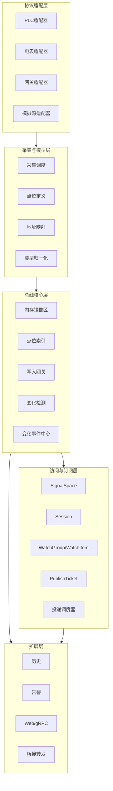
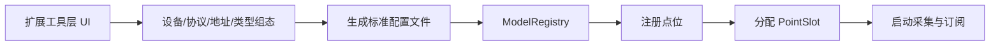
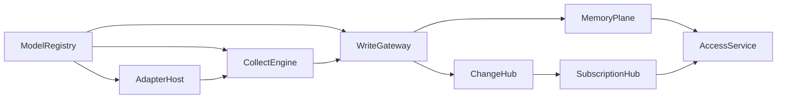
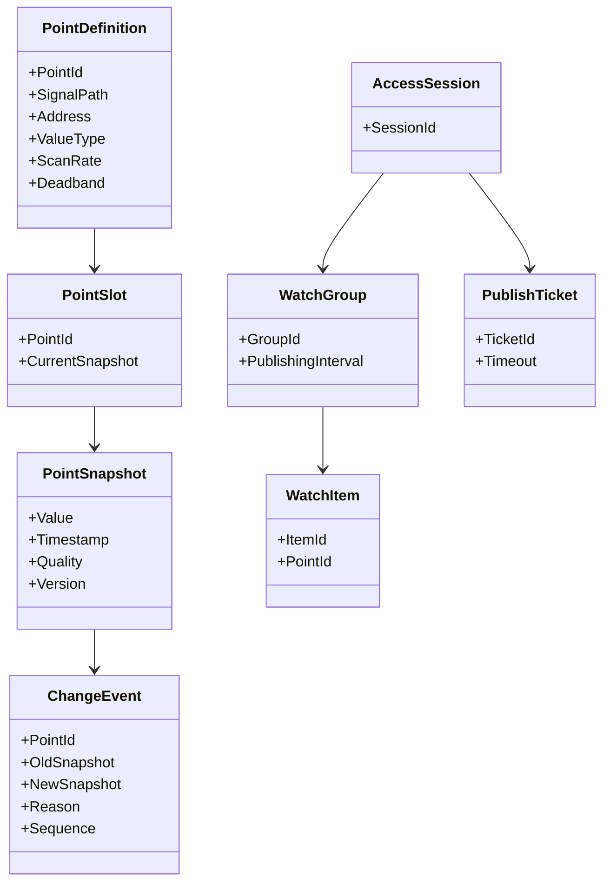
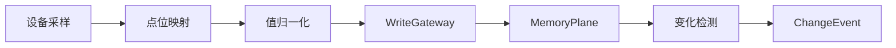
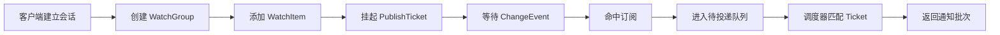
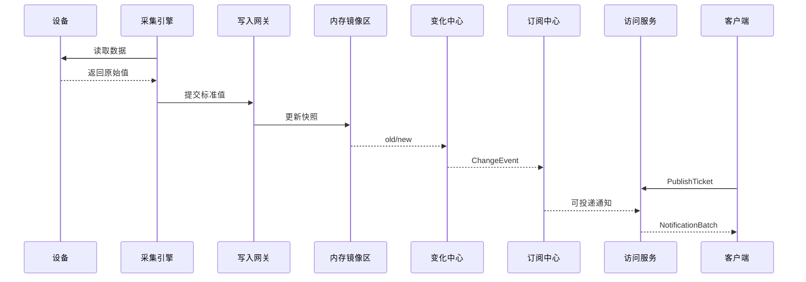

# 架构设计

## 0. 说明

本文档总体设计，重点面向初始设计。

设计约束：

- 建立“地址空间 + 当前值 + 订阅发布 + 会话投递”的思想
- 建立一套实时数据总线架构

本文档按收敛为 4 个部分：

1. 设计目标
2. 总体架构
3. 当前轮次已实现的设计内容与原理
4. 实施计划

本文档使用规则：

- `Arch.md` 是总体设计总纲
- 从下一轮开始，不再持续改动本总纲结构
- 后续每一轮单独生成对应的实施计划文档作为补充

---

## 1. 设计目标

要解决的是工业实时数据系统里最核心的 4 个问题。

### 1.1 外部数据源种类很多，必须先有统一接入层

PLC、电表、网关、传感器、模拟设备的数据格式、地址模型、采样方式都不同。  
凡是带存储空间且可通讯的设备，理论上都应该支持接入。

因此系统必须具备统一的协议适配层，用来屏蔽不同设备协议的差异。

但如果系统只停留在协议适配这一层，仍然会面临：

- 上层直接依赖具体驱动
- 不同设备缺少统一点位模型
- 订阅发布没有统一语义
- 历史、告警、桥接无法复用同一套变化机制

所以第一目标是：

- 建立统一的协议适配层
- 把所有实时值统一落到一个受控的内存镜像区
- 让内存镜像区成为系统唯一的数据真源

### 1.2 设备值、访问接口、订阅机制常常耦合在一起

很多系统会把“当前值”直接挂在某种接口对象上，例如挂在某个节点对象、接口对象或会话对象里。  
这样会导致：

- 驱动和接口强耦合
- 一个接口变更会影响整体架构
- 后续很难扩展多接口、多客户端、多消费方

所以第二目标是：

- 让值属于总线，不属于接口
- 让采集、存储、订阅、发布相互解耦

### 1.3 值变化后缺少统一的变化传播机制

设备值变化之后，历史模块、告警模块、客户端订阅模块、桥接模块都可能要消费同一份变化。  
如果每个模块都自己去拉数据、自己比较，会导致逻辑重复、语义不一致。

所以第三目标是：

- 把“变化”定义成统一事件
- 由统一变化中心负责生成和分发

### 1.4 缺少一套面向实时数据的访问架构

需要的能力：

- 能浏览逻辑结构
- 能读取当前值
- 能建立订阅
- 能按发布节奏返回变化批次

所以第四目标是：

- 建立访问体系,形成 `SignalSpace + Session + Watch + PublishTicket` 的访问模型

---

## 2. 总体架构

## 2.1 核心理念

核心理念只有一句话：

> 统一点位模型承接设备信号，统一内存镜像承接当前值，统一变化事件承接订阅发布。

拆开来看就是 3 条原则：

- 点位是逻辑对象，不等于设备原始地址
- 当前值存放在内存镜像区，不挂在接口对象上
- 订阅发布围绕变化事件，不围绕驱动回调

---

## 2.2 总体分层

系统建议分为 5 层。



### 2.2.1 协议适配层

职责：

- 对接不同种类的外部设备
- 屏蔽 PLC、电表、网关等协议差异
- 提供统一的读写和采样结果输出
- 向上层暴露一致的设备访问能力


### 2.2.2 采集与模型层

职责：

- 定义点位
- 建立逻辑路径
- 把物理地址映射成统一点位
- 把原始值转换成标准值

这一层负责回答：

- 这个值是谁
- 它来自哪里
- 它应该怎么解释

### 2.2.3 总线核心层

这是系统心脏，职责包括：

- 保存当前值
- 提供快速读取
- 维护版本号、时间戳、质量码
- 判断是否发生有效变化
- 生成统一 `ChangeEvent`

### 2.2.4 访问与订阅层

职责：

- 浏览逻辑空间
- 读取当前值
- 建立会话
- 建立订阅
- 挂起发布票据
- 返回变化通知

### 2.2.5 扩展层

扩展层不拥有数据真值，只消费总线输出：

- 历史消费变化事件
- 告警消费变化事件
- Web/gRPC 消费当前值或订阅流
- 桥接模块消费订阅流或变化事件

---

## 2.3 扩展工具层

除了运行时 5 层之外，增加单独的“扩展工具层”。

这一层不参与运行时数据流，它的职责是做组态和配置生产，最后把配置文件交给核心系统加载。

### 2.3.1 工具层定位

工具层负责解决的问题是：

- 用户不应该手写大量点位配置
- 用户需要做到组态软件式可选择设备、协议、地址、数据类型、扫描周期
- 用户需要通过界面完成建模，再生成标准配置文件
- 核心系统只负责“加载配置并注册内存”，不负责提供复杂配置编辑体验

### 2.3.2 工具层主要能力

- 设备模板管理
- 协议选择
- 地址编辑
- 数据类型选择
- 扫描周期设置
- 点位批量生成
- 分组与逻辑路径配置
- 配置校验
- 配置导出

### 2.3.3 工具层与运行时关系



工具层只负责“生成正确配置”，运行时负责：

- 加载配置
- 建立点位索引
- 建立内存镜像
- 绑定适配器
- 启动采集与发布

### 2.3.4 建议生成的配置内容

建议工具层最终生成统一配置文件，至少包含：

- 设备定义
- 协议类型
- 连接参数
- 点位定义
- 地址描述
- 数据类型
- 扫描周期
- 死区参数
- 逻辑路径
- 分组信息

## 2.4 核心模块

第一阶段建议固定 8 个核心模块。



### 2.4.1 ModelRegistry

负责设备、点位、路径、地址映射的注册与索引。

### 2.4.2 AdapterHost

负责统一管理协议适配器，是协议层进入运行时核心的正式入口模块。

职责包括：

- 适配器注册与发现
- 设备类型与协议类型绑定
- 适配器实例创建
- 适配器生命周期管理
- 向 `CollectEngine` 提供统一的设备访问接口

### 2.4.3 CollectEngine

负责采集任务调度、批量读取、失败重试，并通过 `AdapterHost` 调度具体适配器执行实际通信。

### 2.4.4 MemoryPlane

负责保存所有点位的当前快照，是系统唯一数据真源。

### 2.4.5 WriteGateway

负责统一写入流程：写入、比较、更新、推进版本。

### 2.4.6 ChangeHub

负责将快照更新转成统一变化事件。

### 2.4.7 SubscriptionHub

负责管理订阅、监视项、通知队列和可投递状态。

### 2.4.8 AccessService

负责提供访问能力：浏览、读取、订阅、发布。


## 2.5 核心对象

系统的核心对象关系如下。



对象含义非常简单：

- `PointDefinition`：逻辑点位定义
- `PointSlot`：点位在镜像区里的槽位
- `PointSnapshot`：点位当前快照
- `ChangeEvent`：一次标准化变化
- `AccessSession`：客户端访问会话
- `WatchGroup/WatchItem`：订阅关系
- `PublishTicket`：客户端挂起的待发布请求

---

## 2.6 核心数据流

### 2.6.1 写入主链



原理：

- 驱动只负责把值采回来
- 模型层把值映射成统一点位
- 写入网关负责统一写入
- 镜像区负责存当前值
- 变化中心负责把更新变成事件

### 2.6.2 订阅发布主链



原理：

- 客户端先声明“我关心什么”
- 再声明“我准备好接收通知了”
- 服务端只有在变化到来且有可用票据时才返回数据

这能自然解决：

- 消费节奏控制
- 保活
- 背压
- 批量投递

### 2.6.3 整体时序



---

## 2.7 当前阶段的核心原则

这一版架构必须坚持 5 条原则：

- 当前值只存一份，统一放在 `MemoryPlane`
- 所有订阅都只盯点位变化，不盯设备驱动
- 所有访问能力都从 `SignalSpace` 和 `MemoryPlane` 出发
- 所有变化都先变成 `ChangeEvent`
- 扩展模块只能消费总线，不得直接侵入总线内部状态

---

## 3. 当前设计内容与原理

明确了以下内容:

### 3.1 已确定的系统边界

- 系统核心为是实时数据总线 + 外部协议适配器
- 第一阶段主线是“采集 -> 镜像 -> 变化 -> 订阅发布”
- 第二优先级是多协议驱动、历史、告警、南北向接口
- 安全体系先不展开

### 3.2 已确定的核心结构

- 5 层总体架构
- 8 个核心模块
- 点位、快照、变化事件、会话、订阅、发布票据等核心对象
- 写入主链与订阅发布主链

### 3.3 已确定的关键原理

#### 原理一：镜像区是真值

任何模块读取当前值，都应该来自 `MemoryPlane`。  
这样可以保证所有访问接口看到的是同一份状态。

#### 原理二：变化事件是传播标准

历史、告警、订阅、桥接以后都应该基于 `ChangeEvent` 工作。  
这样可以避免每个模块都重复做变化比较。

#### 原理三：发布由票据驱动

客户端通过 `PublishTicket` 表示“我准备好接收下一批通知”。  
服务端在数据准备好之后，用这张票据返回通知批次。

#### 原理四：逻辑空间与值存储分离

`SignalSpace` 负责组织结构和浏览体验。  
`MemoryPlane` 负责保存值和快照。  
两者分离后，逻辑结构演进不会破坏值存储模型。

---

## 4. 实施计划

预计按 6 轮推进，后续按照实施计划逐个推进。


### 4.1 第 1 轮：总体设计

目标：

- 明确系统定位是实时数据总线 + 外部协议适配器
- 明确第一阶段主线是“采集 -> 镜像 -> 变化 -> 订阅发布”
- 明确总体分层、核心模块、核心对象和主数据流
- 明确系统边界、设计目标和非目标

本轮产出：

- 设计目标
- 总体分层
- 核心模块
- 核心对象
- 核心数据流

当前状态：

- 已完成

### 4.2 第 2 轮：核心原理设计

目标：

- 明确 `MemoryPlane` 是唯一数据真源
- 明确 `ChangeEvent` 是统一变化传播标准
- 明确 `SignalSpace` 与值存储分离
- 明确 `PublishTicket` 驱动的订阅投递机制
- 明确当前阶段必须遵守的核心原则

本轮产出：

- 核心原则
- 写入与变化原理
- 订阅与投递原理
- 当前轮次已实现的设计内容与原理

当前状态：

- 已完成

### 4.3 第 3 轮：访问服务设计

目标：

- 定义 `AccessService` 的命令集
- 定义浏览、读取、写入、订阅、发布的请求响应模型
- 定义错误码与状态码

输出内容建议：

- 服务接口图
- 请求响应结构
- 时序图

交付方式：

- 单独生成第 3 轮实施计划文档

### 4.4 第 4 轮：驱动与采集设计

目标：

- 定义协议适配器抽象
- 定义驱动抽象
- 定义适配器注册与设备模板模型
- 定义采集调度器
- 定义批量读取与重试模型
- 定义原始值到标准值的归一化流程

输出内容建议：

- 适配器接口图
- 驱动接口图
- 采集状态图
- 调度流程图

交付方式：

- 单独生成第 4 轮实施计划文档

### 4.5 第 5 轮：订阅与投递设计

目标：

- 定义 `SubscriptionHub`
- 定义 `WatchGroup/WatchItem`
- 定义投递队列和调度器
- 定义保活、超时、顺序号、批量投递策略

输出内容建议：

- 类图
- 状态图
- 时序图

交付方式：

- 单独生成第 5 轮实施计划文档

### 4.6 第 6 轮：扩展能力设计

目标：

- 定义历史模块如何消费变化事件
- 定义告警模块如何消费变化事件
- 定义 Web/gRPC/桥接如何挂接总线
- 定义配置热更新与可观测性边界

输出内容建议：

- 扩展架构图
- 事件流图
- 模块边界图

交付方式：

- 单独生成第 6 轮实施计划文档

### 4.7 执行规则

- `Arch.md` 只保留总体设计与 总计划
- 每一轮单独生成实施计划文档
- 实施计划文档只聚焦该轮目标，不重复总纲
- 每轮完成后，再进入下一轮计划

---

## 5. 当前总结

总体方向是：

- 用统一点位模型承接设备数据
- 用统一内存镜像区保存当前值
- 用统一变化事件驱动订阅发布
- 用统一访问架构提供浏览、读取、订阅、发布能力

第一阶段先把这条主链打通：

```text
设备采集 -> 点位映射 -> 内存镜像 -> 变化事件 -> 订阅发布
```

后续所有能力都围绕这条主链扩展，而不是绕开它单独生长。
